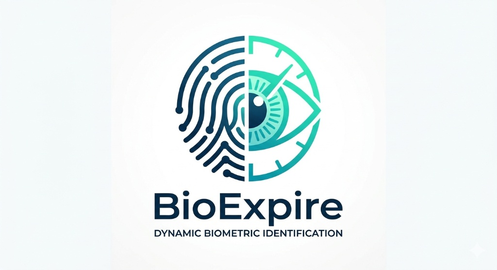

README.md
# 

# BioExpire Protocol

**[ES]** El fin de la biometría estática. El inicio de la soberanía digital del ser humano.
**[EN]** The end of static biometrics. The beginning of human digital sovereignty.

## Lógica del Protocolo / Core Logic
**[ES]** BioExpire utiliza la muestra física como una semilla de entropía que, combinada con variables de tiempo (Timestamp) e identidad de hardware (Device ID), genera un hash único de 512 bits.
**[EN]** BioExpire uses the physical sample as an entropy seed that, combined with time variables (Timestamp) and hardware identity (Device ID), generates a unique 512-bit hash.

## Autor / Author
Artur Wexley
